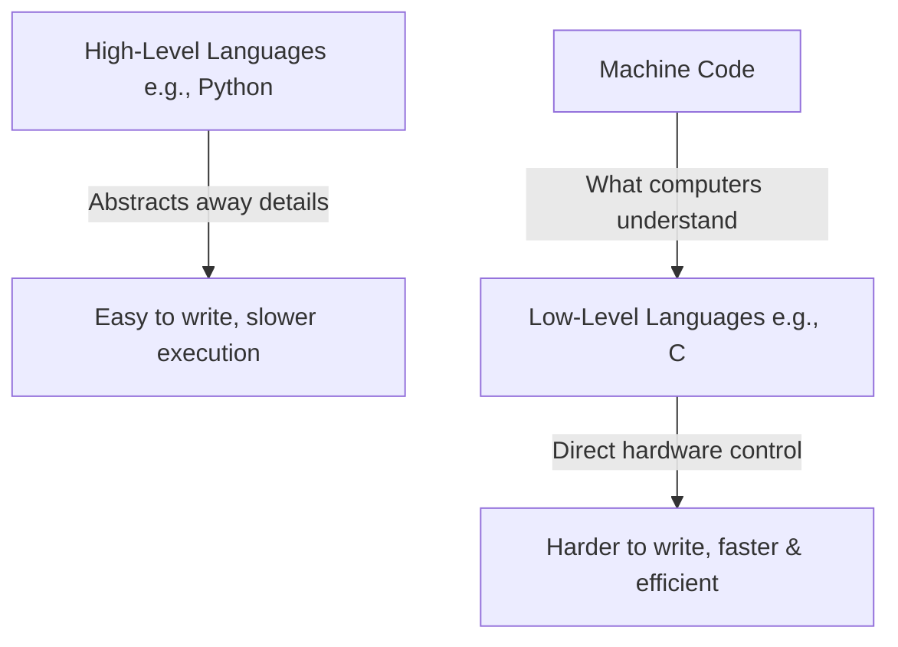
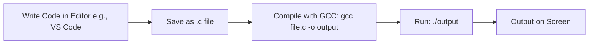
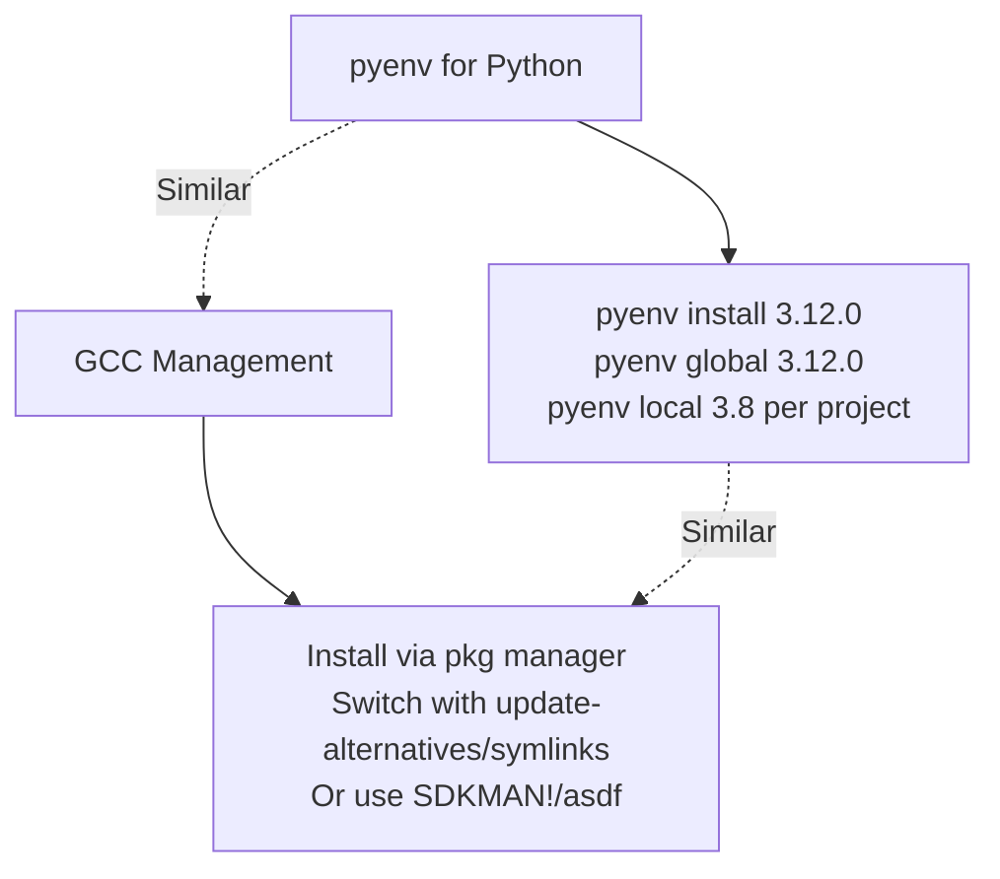
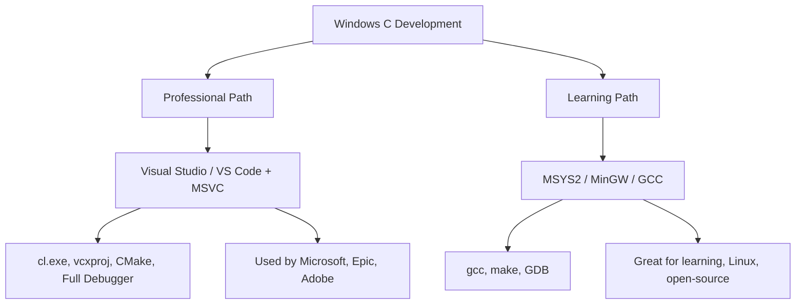

### Course Guidelines:
- **Pace**: One "day" per response (or as you request). Aim to spend 1-2 hours per day practicing.
- **Prerequisites**: None! We'll assume zero prior knowledge.
- **Tools Needed**: A computer with a C compiler (I'll guide you on setup). Free options: GCC (via MinGW on Windows, or built-in on Linux/Mac), or online IDEs like Replit or Compiler Explorer.
- **How to Proceed**: After each day, practice the code and exercises. Reply with "Next day" or questions, and I'll continue or clarify.
- **Depth**: We'll go in-depth with why things work, common pitfalls, and real-world context.
- **Visuals**: I'll use Mermaid for diagrams (renderable in many markdown viewers; copy-paste into tools like mermaid.live if needed).
- **Code**: All examples are runnable. Test them yourself!

If you have any questions or want to adjust (e.g., slower pace), just say so. Ready to start **Day 1**?

---

### Day 1: Introduction to C – The Absolute Basics (Part 1: What is C and Why Learn It?)
Today, we'll cover the foundational "why" and "what" before touching code. This builds motivation and context. We'll split even this intro into parts.

#### Part 1.1: What is C Programming?
- C is a **procedural programming language** created in the 1970s. It's like a set of instructions you give to a computer to perform tasks.
- Key fact: C is "low-level" compared to languages like Python—it's closer to how computers actually work (using memory and hardware directly), which makes it fast and efficient but requires careful handling.
- Analogy: Think of C as building a house with bricks (manual control) vs. using pre-made Lego sets (higher-level languages).

**Visual Diagram: High-Level vs. Low-Level Languages**


#### Part 1.2: History and Why Learn C?
- **History**: Developed by Dennis Ritchie at Bell Labs (1972) to build the Unix OS. It's the foundation for many modern languages (C++, Java, etc.) and systems (OS kernels, embedded devices).
- **Why Learn It?**
  - Builds strong programming fundamentals (memory management, efficiency).
  - Used in: Operating systems (Linux), games, embedded systems (IoT devices), performance-critical apps.
  - Job demand: Essential for systems programming, cybersecurity, etc.
  - Fun fact: Learning C makes other languages easier because you understand "under the hood."

**Proof (Exercise)**: No code yet! Research: Search online for "real-world uses of C" and list 3 examples (e.g., Windows kernel parts are in C). This "proves" its relevance. Share your list next time!

#### Part 1.3: Setting Up Your Environment
Before coding, you need a way to write and run C programs.
- **Option 1: Online IDE** (Easiest for beginners—no install):
  - Go to repl.it or onlinegdb.com. Create a free account, select "C" as language.
- **Option 2: Local Setup** (Recommended for depth):
  - **Windows**: Download MinGW (mingw.org), install GCC. Add to PATH.
  - **Linux/Mac**: GCC is often pre-installed; check with `gcc --version` in terminal. Install via apt/brew if needed.
- Test: Open a terminal/command prompt, type `gcc --version`. If it works, you're set!


**Visual Diagram: Basic C Program Workflow**



**Code Example: Your First (Non-Running) Snippet**
We'll run real code tomorrow, but here's a preview of a simple "Hello World" program:

```c
#include <stdio.h>  // This includes standard input/output library

int main() {  // Main function: Entry point of every C program
    printf("Hello, World!\n");  // Prints text to screen
    return 0;  // Ends the program successfully
}
```

<hr>
<h3 style="text-align: center;">Versions</h3>
<hr>

The latest version of the C programming language standard is **C23**, formally known as ISO/IEC 9899:2024. It was published by the International Organization for Standardization (ISO) on October 31, 2024, and supersedes the previous standard, C17 (ISO/IEC 9899:2018).

### Key Highlights of C23:
- **Major Changes**: Introduces features like the `typeof` operator (for type inference), better support for `const` with arrays, mandatory support for variably modified types, annex K for bounds-checking interfaces, and numerous library updates (e.g., new functions for Unicode handling and bit manipulation).
- **Backward Compatibility**: It's largely compatible with prior versions (C11, C17), but includes fixes for defects and clarifications.
- **Adoption**: Compilers like GCC 15+ default to C23 support. For learning from scratch (as in our course), we'll stick to core features common across C11/C17 for a strong foundation—I'll note C23-specific ones as "advanced" later.

If you're ready to compile code with a specific standard, use flags like `-std=c11` (safe default) or `-std=c23` in GCC.


Yes, you can absolutely download and manage multiple versions of the C compiler (primarily GCC, the most common one) on your system, much like how pyenv handles multiple Python versions. However, it's not quite as seamless as pyenv—there's no single "official" tool exactly like it for C/GCC, but there are several straightforward methods to install, switch, and manage versions per project or globally. This avoids conflicts and lets you compile code against specific standards (e.g., C11 for basics, C23 for advanced features).

I'll break it down step-by-step, including pros/cons and setup examples for common OSes (Linux, macOS, Windows). We'll focus on GCC since it's free, open-source, and supports all C standards. (Clang, another compiler, can be managed similarly but we'll stick to GCC for now.)

### Why Manage Multiple Versions?
- **Compatibility**: Older code might need GCC 4.x; new features (like C23) require GCC 13+.
- **Isolation**: Switch versions without breaking system tools.
- **Like pyenv**: Install versions side-by-side, set a global default, or use per-directory configs.

**Visual Diagram: Comparison to pyenv Workflow**


### Method 1: OS Package Manager (Easiest for Beginners – Like apt/brew Installing Multiple "Packages")
Most OSes let you install versioned packages directly. No need to build from source.

- **Linux (Ubuntu/Debian)**:
  1. Update repos:
   
   ```bash 
   sudo apt update
   ```
  
  2. Install multiple: `sudo apt install gcc-11 gcc-12 gcc-13` (adjust versions; check available with `apt search gcc-`).
  3. Manage like pyenv:
     - Use `update-alternatives` (built-in tool): 
       ```
       sudo update-alternatives --install /usr/bin/gcc gcc /usr/bin/gcc-11 11
       sudo update-alternatives --install /usr/bin/gcc gcc /usr/bin/gcc-13 13
       sudo update-alternatives --config gcc  # Interactive menu to switch default
       ```
     - Per-project: Add to a script or `.bashrc`: `export CC=/usr/bin/gcc-13`.
  - Verify: `gcc --version` (switches based on config).

- **macOS (via Homebrew)**:
  1. Install Homebrew if needed: `/bin/bash -c "$(curl -fsSL https://raw.githubusercontent.com/Homebrew/install/HEAD/install.sh)"`.
  2. Install multiple: `brew install gcc@11 gcc@13` (versions like `@11` for GCC 11.x).
  3. Manage:
     - Switch with: `brew unlink gcc@11 && brew link gcc@13` (unlinks old, links new as default `gcc`).
     - Or use symlinks: `ln -s /opt/homebrew/bin/gcc-13 /usr/local/bin/gcc`.
     - Per-project: `export CC=/opt/homebrew/bin/gcc-13-mp-13` (note the `-mp-` suffix for macOS).
  - Verify: `gcc-13 --version`.

- **Windows (via MSYS2 or Chocolatey)**:
  1. Install MSYS2 (msys2.org) or Chocolatey (chocolatey.org).
  2. MSYS2: `pacman -S mingw-w64-x86_64-gcc` (default latest); for multiples, download from sourceforge.net/projects/mingw (e.g., GCC 8, 12) and extract to separate folders like `C:\mingw-gcc8`.
  3. Manage: Add paths to PATH env var (System Properties > Environment Variables). Use batch scripts to switch: `set PATH=C:\mingw-gcc13\bin;%PATH%`.
  - No exact "pyenv" equivalent, but tools like Scoop (scoop.sh) can install versioned GCC.

**Pros**: Quick, no compilation. **Cons**: Limited to packaged versions; switching is manual-ish.

### Method 2: Build from Source with Prefixes (Flexible, Like pyenv's Source Builds)
Download and compile GCC yourself for any version—great for exact control (e.g., C23 support in GCC 14+).

1. Download: Go to gcc.gnu.org/onlinedocs, get source tarball (e.g., gcc-13.2.0.tar.gz).
2. Prerequisites: Install build deps (e.g., Linux: `sudo apt install build-essential libgmp-dev libmpfr-dev libmpc-dev`).
3. Build & Install (per version):
   ```
   tar -xzf gcc-13.2.0.tar.gz
   cd gcc-13.2.0
   ./configure --prefix=/usr/local/gcc-13 --enable-languages=c  # Prefix isolates it
   make -j$(nproc)  # Builds (takes 30-60 min)
   sudo make install
   ```
   Repeat for another version (e.g., `--prefix=/usr/local/gcc-11`).
4. Manage like pyenv:
   - Symlinks: `sudo ln -sf /usr/local/gcc-13/bin/gcc /usr/local/bin/gcc`.
   - Or scripts: Create `switch-gcc.sh`:
     ```bash
     #!/bin/bash
     VERSION=$1
     unlink /usr/local/bin/gcc  # Remove old symlink
     ln -s /usr/local/gcc-$VERSION/bin/gcc /usr/local/bin/gcc
     ```
     Run: `./switch-gcc.sh 13`.
   - Per-project: Use `.gcc-version` file (like pyenv's `.python-version`) with a wrapper script to check and set PATH.
5. Verify: `/usr/local/gcc-13/bin/gcc --version`.

**Pros**: Any version, full customization. **Cons**: Time-consuming to build.

### Method 3: Third-Party Version Managers (Closest to pyenv)
For a pyenv-like experience (CLI to install/switch seamlessly):

- **SDKMAN!** (Linux/macOS; sdkman.io – supports Java but also GCC/Clang):
  1. Install: `curl -s "https://get.sdkman.io" | bash && source "$HOME/.sdkman/bin/sdkman-init.sh"`.
  2. Use: `sdk install gcc 13.2.0` (lists available); `sdk use gcc 13.2.0` (switches); `sdk default gcc 13.2.0`.
  - Per-project: `sdk env init` creates `.sdkmanrc` file.

- **asdf** (asdf-vm.com – multi-language, including C/GCC via plugins):
  1. Install: See asdf-vm.com/guide/getting-started.html.
  2. Add plugin: `asdf plugin add gcc https://github.com/asdf-community/asdf-gcc.git`.
  3. Use: `asdf install gcc 13.2.0`; `asdf global gcc 13.2.0`; `asdf local gcc 11.4.0` (per dir, like pyenv).
  - Super pyenv-like!

- **Gentoo/Other Distros**: If on Gentoo, use `emerge --ask sys-devel/gcc:13` for slots (built-in multi-version).

**Pros**: Automated switching, per-project. **Cons**: Extra setup; not Windows-native (use WSL for Linux tools).

### Quick Tips & Code Example
- Always specify standard: `gcc -std=c11 file.c -o output` (forces C11 even if default is newer).
- Test Switching:
  ```bash
  # Script to demo (save as test-gcc.sh, chmod +x)
  echo "Using: $(gcc --version | head -1)"
  gcc -std=c23 -E -x c - <<EOF  # Preprocess C23 code snippet
  #if __STDC_VERSION__ >= 202311L  // C23 check
  printf("C23 supported!\n");
  #endif
  EOF
  ```
  Run with different GCCs to see differences.


<!-- Installing instructions -->

<hr>
<h3>Best IDE For C and C++ Developer</h3>
<hr>


### Short Answer:  
**No — professionals almost NEVER use raw MSYS2 + GCC like this in real-world Windows C development.**  
Instead, **Visual Studio + MSVC (Microsoft C/C++ compiler)** is the **industry standard** on Windows, especially in:

- Game engines (Unreal, Unity C++ backend)  
- Enterprise software (Microsoft, Adobe, Autodesk)  
- Drivers, OS-level tools  
- Any team using **Visual Studio Code** professionally

But… **your MSYS2 setup is still valuable** — for **learning C from scratch**, **cross-platform projects**, and **open-source contributions**.

Let’s break it down clearly.

---

## Professional C Development on Windows: The Real World

| Tool | Used By | Why |
|------|--------|-----|
| **Visual Studio (Full IDE)** | 95%+ of Windows C/C++ pros | Full debugger, IntelliSense, build system, MSVC compiler, GUI tools |
| **Visual Studio Code + MSVC** | Growing fast (modern teams) | Lightweight + full power of MSVC via `cl.exe` |
| **MSYS2 / MinGW / GCC** | <5% (niche) | Only for open-source, Linux compatibility, or personal projects |

> **Bottom line**: If you want to **think and work like a pro**, learn **Visual Studio Code + MSVC**, not GCC on Windows.

---

## Why MSYS2/GCC is *Not* Professional on Windows

| Issue | Explanation |
|-------|-----------|
| No official Microsoft support | MSVC is the only compiler Microsoft guarantees for Windows APIs |
| Debugger integration weak | GDB is clunky vs. Visual Studio’s world-class debugger |
| Build systems mismatch | CMake defaults to MSVC on Windows; MSYS2 needs hacks |
| Team collaboration | No one shares `.vcxproj` files with GCC — breaks team workflow |

---

## Recommended Professional Setup (VS Code + MSVC)

This is what **real Windows C developers use** — and it’s **free**!

### Step-by-Step: Install Professional C Environment

#### 1. **Install Visual Studio Build Tools (MSVC)**
- Go to: [https://visualstudio.microsoft.com/visual-cpp-build-tools/](https://visualstudio.microsoft.com/visual-cpp-build-tools/)
- Download **"Build Tools for Visual Studio 2022"**
- Run installer → Select:
  - **"C++ build tools"**
  - **"Windows 10/11 SDK"**
  - **"CMake tools for C++"**
- Install (~3–5 GB)

> This gives you `cl.exe` — the **real** professional C compiler.

#### 2. **Install Visual Studio Code**
- [code.visualstudio.com](https://code.visualstudio.com/)
- Install extensions:
  - **C/C++** (by Microsoft)
  - **CMake Tools**
  - **CodeLLDB** or use built-in debugger

#### 3. **Create Your First Pro Project**

```bash
mkdir my-c-project && cd my-c-project
code .
```

**`main.c`**
```c
#include <stdio.h>

int main() {
    printf("Hello from Professional MSVC!\n");
    return 0;
}
```

**`CMakeLists.txt`** (pro build system)
```cmake
cmake_minimum_required(VERSION 3.20)
project(HelloC LANGUAGES C)

add_executable(hello main.c)
```

#### 4. **Build & Debug in VS Code**
- Press `Ctrl+Shift+P` → "CMake: Configure"
- Then "CMake: Build"
- Press **F5** to **debug with breakpoints**

You now have:
- Full **IntelliSense**
- **Step-through debugging**
- **Real Windows compiler (MSVC)**
- **CMake** (used by 90% of C++ projects)

---

## So When Should You Use MSYS2/GCC?

| Use Case | Tool |
|--------|------|
| Learning C from scratch (our course) | MSYS2 or online (replit) |
| Linux/macOS cross-compilation | GCC |
| Contributing to open-source (e.g. Git, Redis) | GCC |
| Embedded systems (Arduino, STM32) | GCC |
| **Professional Windows dev** | **MSVC + VS Code / Visual Studio** |

---

## Visual Diagram: Pro vs Learning Setup



---

## Final Recommendation for You

| Goal | Tool |
|------|------|
| **Strong C foundation (our course)** | Start with **MSYS2 + GCC** (simple, portable) |
| **After Day 10** | Switch to **VS Code + MSVC** for pro skills |
| **Job-ready** | Master **CMake + MSVC + Debugging** |

---

### Next Steps

1. **Keep using MSYS2 for now** — perfect for Day 2 (Hello World).
2. **After 1–2 weeks**, I’ll guide you to **switch to VS Code + MSVC** (Day 15ish).
3. You’ll end up **knowing both** — rare and powerful!

---
